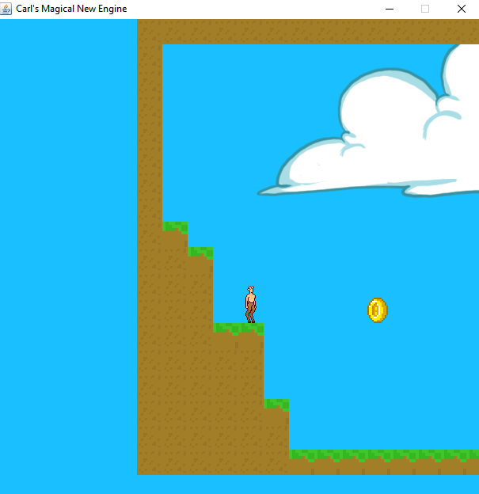
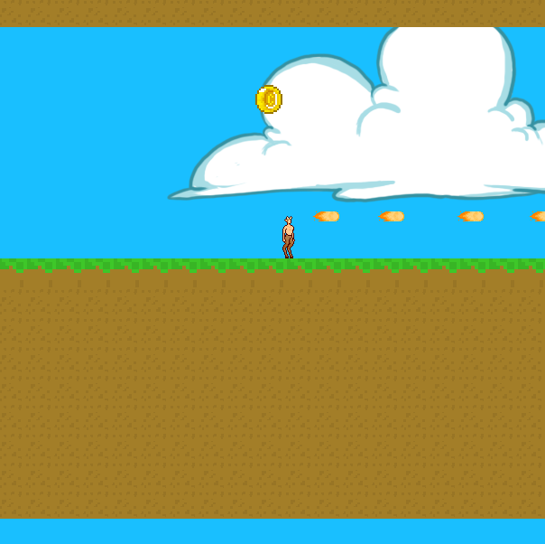
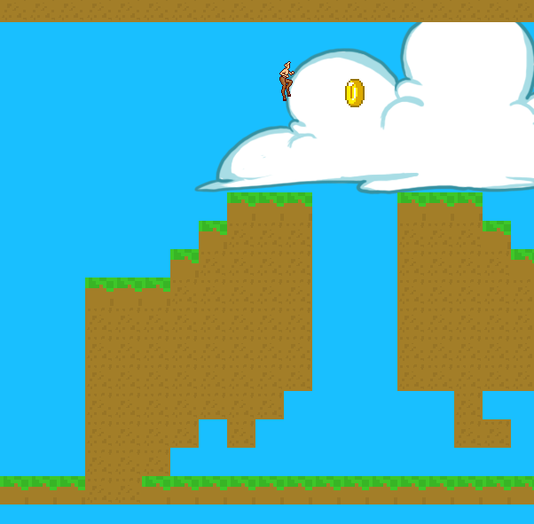

# game-demo
A 2D platformer game demo. Explore the game world as a dynamic hero Mr Satyr.
Created using Java, AWT, and Swing

## Features / How to use?
Use the standard W, A, and D keys to move the hero (jump, left and right respectively).
Collect coins along you journey and reach the markers to reach new levels!
Press the SPACE bar to shoot a fireball.

## Screenshots

 

 

## Credits
Inspired by [RealTutsGML](https://www.codingmadesimple.com) tutorial.

## License
MIT © [cjntifo]()
